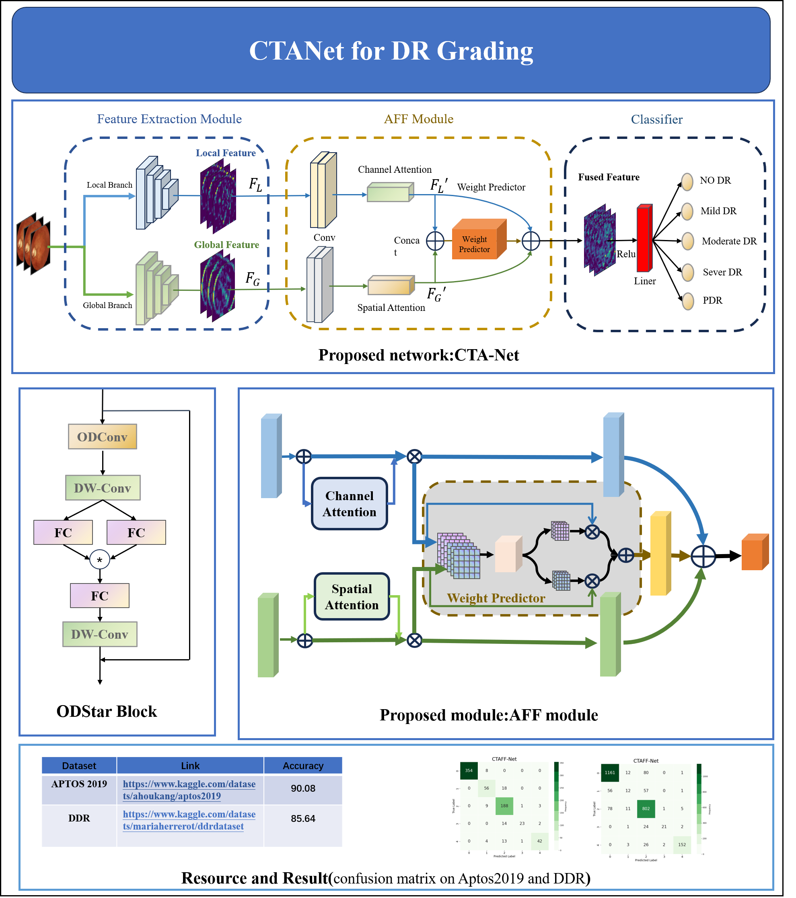

# CTA-Net for DR Grading

This repository provides a PyTorch implementation of a multi-branch neural network for image classification. The model combines local and global branches, leveraging both convolutional and transformer-based layers for comprehensive feature extraction.

## Overview


The model consists of:
- **Local Branch**: Convolutional layers for capturing fine-grained, localized features.
- **Global Branch**: Transformer layers for capturing broader, contextual information.
- **Feature Fusion**: Combines local and global features to enhance performance on classification tasks.

## 1.Create Envirement:

-Python 3.8+
-NVIDIA GPU+CUDA
- ```bash
  cd CTA-Net
  pip install -r requirements.txt
  
## 2.Data preparation:
-Download Aptos 2019 dataset:https://www.kaggle.com/datasets/mariaherrerot/aptos2019
-Download DDR dataset:https://www.kaggle.com/datasets/mariaherrerot/ddrdataset
```
├── data/
    ├── train/
    ├── val/
    └── test/
```

## 3.Training
```bash
   cd /CTA-Net
   python tarin.py --train_data_path ../datasets/aptos2019/train --val_data_path ../dataset/aptos2019/val
   python tarin.py --train_data_path ../datasets/ddr/train --val_data_path ../dataset/ddr/val

## 4.Testing
```bash
   cd /CTA-Net
   python test.py --train_data_path ../datasets/aptos2019/test
   python test.py --train_data_path ../datasets/ddr/test


Clone the repository:
   ```bash
   git clone https://github.com/Renjacklove/CTA-Net.git
   cd CTA-Net

## DOI

[](https://doi.org/10.5281/zenodo.14046093)
